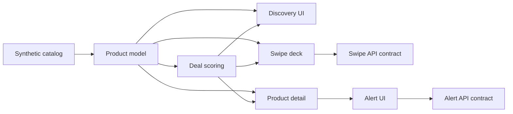

# Architecture

## Goal

Caça Preço is a product-oriented price discovery interface. The current public version focuses on the interaction model and the decision layer without pretending that live marketplace ingestion already exists.

## Boundaries



### `src/lib`

Contains the portable product rules:

- `types.ts` — product, offer and price-history contracts
- `scoring.ts` — deterministic deal score and decision thresholds
- `catalog.ts` — synthetic public catalog and product lookup
- `swipe-action.ts` — canonical swipe semantics and legacy normalization

The UI does not decide whether a deal is good. It consumes the result of the scoring layer.

### `src/components`

Product-facing interaction components:

- `ProductCard` — discovery card
- `SwipeDeck` — drag interaction and action submission
- `PriceSparkline` — dependency-light price history visualization
- `StoreComparison` — normalized store-offer presentation
- `DealBadge` — decision signal

### `src/app/api`

Route handlers expose the current public contracts:

- products are returned from the synthetic catalog
- swipe payloads are normalized and validated
- alert payloads are validated
- swipe and alert responses explicitly report `persisted: false`

No route claims durable storage.

## Data model

A product owns:

- current price
- 30-day average
- 90-day min/max
- recent drop percentage
- deterministic score + decision
- synthetic store offers
- synthetic price-history points

This is enough to exercise the product experience while keeping the public boundary honest.

## Why scoring is separate from React

The score is a domain rule. Keeping it as a pure function makes it:

- testable without a browser
- reusable by pages and future jobs/APIs
- reviewable during product changes
- replaceable later by a richer model without rewriting the UI

## Future ingestion boundary

A production version should place provider adapters before the product model:

```text
Official / affiliate providers
           │
           ▼
  ingestion + normalization
           │
           ▼
    canonical offers
           │
           ├── price history persistence
           └── product scoring
```

Provider-specific payloads should not leak into UI components.
